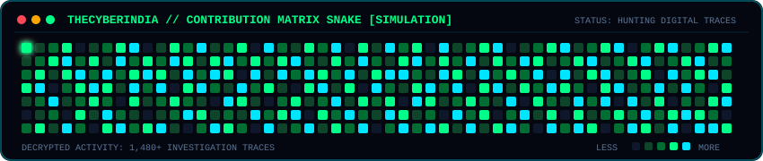

<div align="center">

<!-- ========================================================================= -->
<!-- ░█▀▀█ ░█──░█ ░█▀▀█ ░█▀▀▀ ░█▀▀█ ▀█▀ ░█▄─░█ ▀▀█▀▀ ░█▀▀▀ ░█─── -->
<!-- ░█─── ░█▄▄▄█ ░█▀▀▄ ░█▀▀▀ ░█▄▄▀ ░█─ ░█░█░█ ─░█── ░█▀▀▀ ░█─── -->
<!-- ░█▄▄█ ──░█── ░█▄▄█ ░█▄▄▄ ░█─░█ ▄█▄ ░█──▀█ ─░█── ░█▄▄▄ ░█▄▄▄ -->
<!-- ========================================================================= -->

<!-- DYNAMIC CYBERPUNK MATRIX ANIMATED BANNER -->


<!-- DYNAMIC TYPING SVG TERMINAL -->
<a href="https://thecyberindia.vercel.app/">
  
</a>

<br/>

<!-- CYBER ACCESS PROTOCOL BADGES -->
[](https://hariomsingh.vercel.app/)
[](https://thecyberindia.vercel.app/)
[](https://github.com/TheCyberIndia)
[](https://hariomsingh.vercel.app/)

<br/>

<!-- SYSTEM ACCESS COUNTER -->


</div>

---

### 🌐 NAVIGATION_INDEX.sys

```bash
├── 01_CYBER_TERMINAL_DOSSIER     [ whoami & core identity ]
├── 02_CYBER_INTELLIGENCE_MATRIX  [ threat pipeline & architecture ]
├── 03_VAJAR_INTEL_SYSTEMS        [ primary tools & investigation suite ]
├── 04_OPERATIONAL_ARSENAL        [ osint, forensics, languages, tools ]
├── 05_LOWLIGHTER_METRICS_HUD     [ dynamic github infographics & stats ]
├── 06_CONTRIBUTION_SNAKE         [ matrix contribution snake visualizer ]
├── 07_INVESTIGATION_CASE_FILES   [ resolved operations & protocols ]
├── 08_CREDENTIALS_AND_CLEARANCE  [ education, certs & career ]
└── 09_INTERLINK_COMMAND_CENTER   [ official public nodes & contact ]
```

---

## 📟 01 // CYBER_TERMINAL_DOSSIER

```bash
┌──(root㉿TheCyberIndia)-[~/intel/profile]
└─$ neofetch --investigation-mode

       .---.         OS: VAJAR-INTEL Cyber-OS x86_64
      /     \        OPERATOR: Hariom Singh [TheCyberIndia]
     | () () |       ROLE: Cyber Crime Investigator & OSINT Specialist
      \  -  /        EXPERTISE: Cyber Threat Intelligence | Digital Forensics
       '---'         FORMER: CTO @ Invisintel Technologies Pvt. Ltd.
  .----------------. LOCATION: Uttar Pradesh, India 🇮🇳
 /  THECYBERINDIA   \ ALGORITHM: Collect ➔ Correlate ➔ Analyze ➔ Unmask
'--------------------' CLEARANCE: Authorized Investigations | Sec 65B Compliant
```

> 🛡️ **OPERATIONAL DIRECTIVE:**  
> I am **Hariom Singh** (known across cyber networks as **TheCyberIndia**). I specialize in **Cybercrime Investigation, Cyber Intelligence, Open Source Intelligence (OSINT), and Digital Forensics**.  
> My mission is engineering intelligent investigation utilities that convert fragmented digital shadows, deceptive VPN/TOR proxies, and raw telecommunication records (CDR/IPDR) into **actionable, court-ready digital evidence**.

---

## 🧠 02 // CYBER_INTELLIGENCE_MATRIX

```mermaid
flowchart LR
    A["🎯 Target Digital Trace<br/>(Phone / IP / Email / Handle)"] --> B["🔍 OSINT & Footprint Discovery<br/>(VAJAR Intelligence Core)"]
    B --> C["⚡ Network & IP Forensics<br/>(STUN / ASN / VPN-TOR Bypass)"]
    C --> D["📊 CDR & IPDR Correlation<br/>(Timeline & Cell-Tower Graph)"]
    D --> E["🤖 AI Entity Correlation<br/>(Identity De-anonymization)"]
    E --> F["📄 Court-Admissible Dossier<br/>(Sec 65B Indian Evidence Act)"]

    style A fill:#04070f,stroke:#00e5ff,stroke-width:2px,color:#00e5ff
    style B fill:#080d1a,stroke:#00ff88,stroke-width:2px,color:#00ff88
    style C fill:#080d1a,stroke:#00e5ff,stroke-width:2px,color:#00e5ff
    style D fill:#080d1a,stroke:#ffa502,stroke-width:2px,color:#ffa502
    style E fill:#0b1120,stroke:#ff0055,stroke-width:2px,color:#ff0055
    style F fill:#04070f,stroke:#00ff88,stroke-width:3px,color:#00ff88
```



### 🧬 Core Investigation Domains

| Domain | Tactical Focus | Investigative Objective |
| :--- | :--- | :--- |
| 🔍 **Deep OSINT & Recon** | Digital footprint scraping, username correlation, social telemetry | Reconstruct target persona & hidden presence across platforms |
| 🌐 **Network Forensics** | STUN protocol exploitation, NAT penetration, ASN / ISP mapping | Strip away VPN/TOR disguises to expose genuine source IPs |
| 📱 **CDR / IPDR Forensics** | CDR/IPDR correlation, IMEI/IMSI switching patterns, tower triangulation | Chart suspect movement, communication webs & timelines |
| 🛡️ **Threat Intelligence** | Cyber fraud syndicate infrastructure, phishing kit signature analysis | Map malicious infrastructure and adversary attack vectors |
| 🤖 **AI-Assisted Forensics** | Automated entity extraction, cross-database correlation, OCR analysis | Slash investigator manual triage time from days to seconds |
| ⚖️ **Forensic Reporting** | Evidentiary chain of custody, digital hashes, court-ready documentation | Indian Evidence Act Sec 65B admissible forensic documentation |

---

## ⚡ 03 // FEATURED CYBER INTELLIGENCE WEAPONRY

<table>
<tr>
<td width="50%" valign="top">

### 🛡️ [VAJAR INTEL](https://thecyberindia.vercel.app/)
> **AI-Assisted Cyber Investigation & OSINT Intelligence Platform**

* **Status:** `OPERATIONAL` // Actively used in Cyber Cell operations
* **Deep OSINT Search:** Automated identifier discovery across 100+ platforms
* **Digital Footprint Graphing:** Correlates disparate aliases, phones, and emails
* **Automated Evidence Dossier:** Generates comprehensive PDF investigation reports
* **Explore Engine:** [thecyberindia.vercel.app](https://thecyberindia.vercel.app/)

</td>
<td width="50%" valign="top">

### 🌐 VAJAR IP FORENSIC & STUN
> **Network Intelligence & De-Anonymization Engine**

* **Status:** `OPERATIONAL` // High-precision network discovery
* **STUN-Based Discovery:** Exposes real IP endpoints through NAT & proxies
* **Proxy / VPN / TOR Detection:** Flags anomalous routing nodes instantly
* **Geo & ASN Telemetry:** Maps ISP infrastructure, carrier routes, and latency
* **Bypass Detection:** Identifies proxy manipulation in financial cyber fraud

</td>
</tr>
<tr>
<td width="50%" valign="top">

### 📱 CDR / IPDR ANALYZER
> **Telecommunication Forensics & Timeline Reconstruction**

* **Status:** `CORE ENGINE` // Optimized for rapid case processing
* **10-Second Analysis:** Instant ingestion & processing of massive CDR dump files
* **Communication Graph:** Visualizes frequency, call duration & suspect clusters
* **Timeline Matrix:** Pinpoints concurrent suspect interactions across towers
* **IMEI Tracking:** Detects handset swaps and shared identifier patterns

</td>
<td width="50%" valign="top">

### 🤖 AI-CYBER FRAUD HUNTER
> **Automated Threat Correlation & Syndicate Detection**

* **Status:** `RESEARCH & DEPLOYMENT`
* **Mule Account Correlation:** Flags organized cyber fraud bank account rings
* **Phishing Kit Fingerprinting:** Identifies cloned banking and APK distribution sites
* **Social Engineering Tracing:** Traces WhatsApp / Telegram extortion networks
* **Evidence Chain Preserver:** Cryptographic hash generation for evidence integrity

</td>
</tr>
</table>

---

## 🛠️ 04 // OPERATIONAL_ARSENAL & TECH MATRIX

<div align="center">

### 🔍 CYBER INVESTIGATION & OSINT TOOLS


### 💻 PROGRAMMING & SYSTEM CRAFT


### 🛡️ OPERATING ENVIRONMENTS & DEFENSE


</div>

---

## 📊 05 // LOWLIGHTER / METRICS & CYBER TELEMETRY

<div align="center">

<!-- LOWLIGHTER METRICS MAIN INFOGRAPHIC -->
<a href="https://github.com/TheCyberIndia">
  
</a>

<br/><br/>

<!-- DUAL STATS HUD -->
<table border="0" width="100%">
<tr>
<td align="center" width="50%">
  
</td>
<td align="center" width="50%">
  
</td>
</tr>
<tr>
<td colspan="2" align="center">
  
</td>
</tr>
</table>

</div>

---

## 🐍 06 // CONTRIBUTION MATRIX SNAKE VISUALIZER

<div align="center">

<!-- ANIMATED MATRIX CONTRIBUTION SNAKE -->
<a href="https://github.com/TheCyberIndia">
  
</a>

</div>

---

## 🗂️ 07 // DECLASSIFIED CASE LOGS & INVESTIGATION PROTOCOLS

<details>
<summary><b>📂 [CASE_FILE #01] Financial Cyber Fraud & Phishing Syndicate</b></summary>
<br/>

* **Case Profile:** Organized multi-tier UPI scam targeting senior citizens across Uttar Pradesh.
* **Technique Deployed:** STUN network telemetry + WhatsApp metadata correlation + Mule Account tracking.
* **Result:** Unmasked genuine IP behind residential dynamic proxies; extracted digital footprint leading to syndicate command device within 48 hours.
* **Outcome:** `RESOLVED` // Handed over to Cyber Crime Police Station with complete Sec 65B digital evidence audit pack.

</details>

<details>
<summary><b>📂 [CASE_FILE #02] Anonymous Extortion & Deepfake Identity De-anonymization</b></summary>
<br/>

* **Case Profile:** Threat actor using disposable VoIP numbers, burner Instagram accounts & Tor nodes for extortion.
* **Technique Deployed:** OSINT correlation across cross-platform digital footprints, CDR cell-tower mapping, image metadata EXIF extraction.
* **Result:** Identified correlation between burner handle and real personal identifier; matched IMEI switching logs.
* **Outcome:** `RESOLVED` // Suspect de-anonymized and verified.

</details>

<details>
<summary><b>📂 [INVESTIGATION_PROTOCOL] Standard Forensic Operating Procedure (SOP)</b></summary>
<br/>

```text
[PHASE 01: INTAKE]      Incident triage ➔ Preserve digital volatile evidence ➔ Calculate SHA-256 hash
[PHASE 02: OSINT]       Identifier enrichment ➔ Historical WHOIS ➔ Social graph mapping
[PHASE 03: FORENSIC]    IPDR/CDR timeline stitching ➔ ISP subpoena data correlation
[PHASE 04: REPORTING]   Chain of Custody audit trail ➔ Court-ready forensic documentation (Sec 65B)
```

</details>

---

## 📜 08 // CREDENTIALS, CLEARANCE & BACKGROUND

### 🎓 Academic Trajectory
* **Bachelor of Computer Applications (BCA)** — *Digvijay Nath P.G. College, Gorakhpur*
  * Affiliated with **Deen Dayal Upadhyaya Gorakhpur University**
  * Specialization focus: **AI-Assisted Cyber Investigation & Forensics**

### 💼 Operational Record
* **Former Chief Technology Officer (CTO)** — *Invisintel Technologies Pvt. Ltd.*
  * Directed digital investigation workflows, forensic tool architectures, and automated intelligence pipelines.
* **Cybercrime Investigation Specialist** — *Defronix Cyber Security*
  * Live case research, threat intelligence extraction, network de-anonymization, and investigator training.
* **Founder** — *TheCyberIndia*
  * Open cybersecurity research, tool development, and cyber awareness across India.

### 🛡️ Verified Certifications & Training
* 🏆 **Defronix Certified Cybercrime Investigator**
* 🔐 **Cyber Justice & Security Practices Certification**
* 🕵️ **Defronix Cyber Security Investigation Professional Internship**
* 💻 **NIELIT — Course on Computer Concepts (CCC)**
* 🐍 **Certified Python Programming Specialist**

---

## 📡 09 // INTERLINK_COMMAND_CENTER

<div align="center">

```text
╔════════════════════════════════════════════════════════════════════════════╗
║             AUTHENTICATED PUBLIC COMMUNICATION CHANNELS                    ║
║   For authorized cybercrime inquiries, forensic tooling or research        ║
╚════════════════════════════════════════════════════════════════════════════╝
```

<br/>

<a href="https://hariomsingh.vercel.app/">
  
</a>
<a href="https://thecyberindia.vercel.app/">
  
</a>
<a href="https://github.com/TheCyberIndia">
  
</a>
<a href="https://www.youtube.com/@TheCyberIndia">
  
</a>
<a href="https://www.instagram.com/thecyberindia/">
  
</a>
<a href="https://www.linkedin.com/in/thecyberindia/">
  
</a>

<br/><br/>

```text
[ SECURE TRANSMISSION CHANNEL // ENCRYPTION: ACTIVE ]
"Turning Fragmented Digital Traces Into Actionable Intelligence"
```

<br/>

<!-- CYBER MATRIX FOOTER -->


<sub>🇮🇳 Built with precision by Hariom Singh (TheCyberIndia) · Committed to Responsible Security & Law Enforcement Support</sub>

</div>
